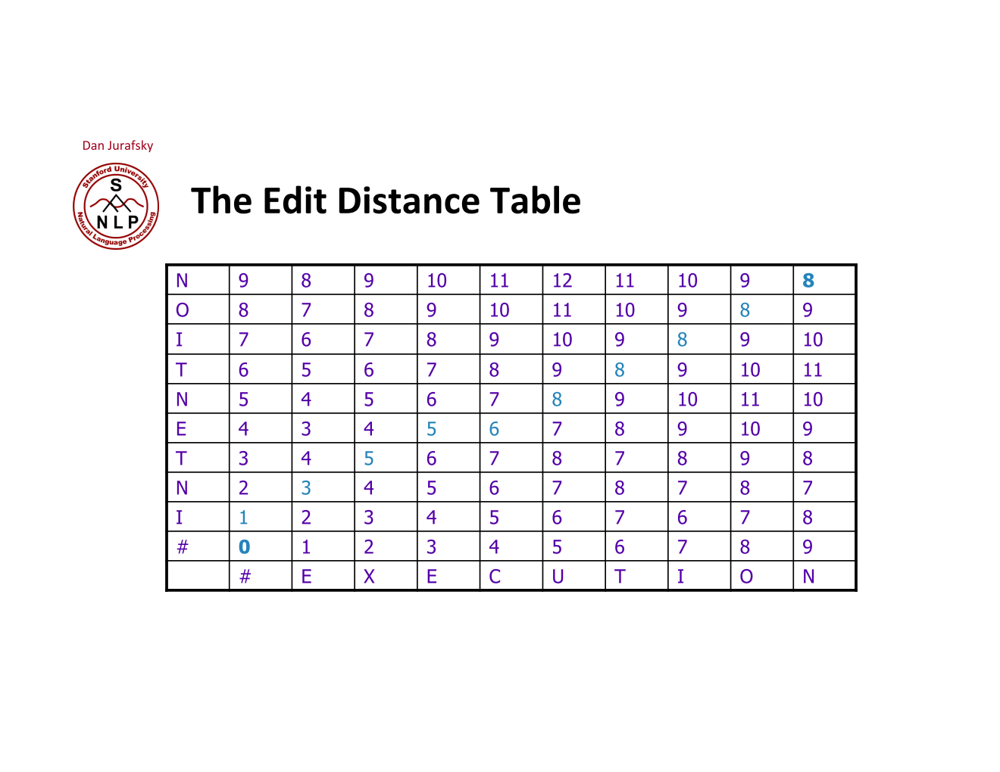
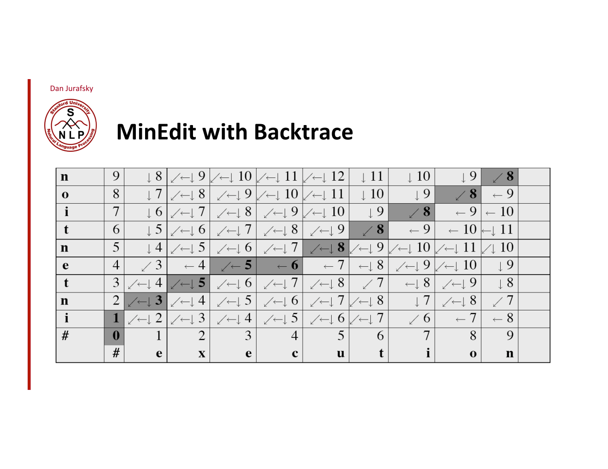
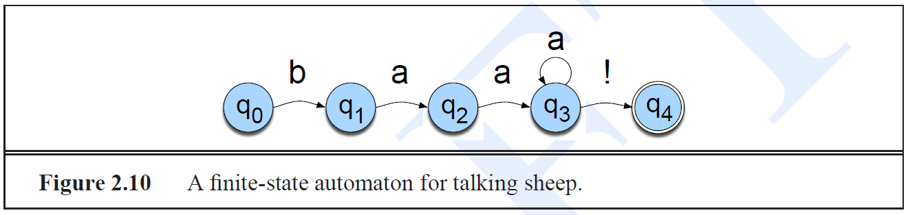
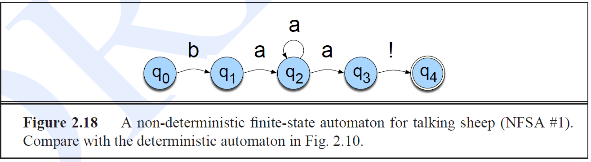
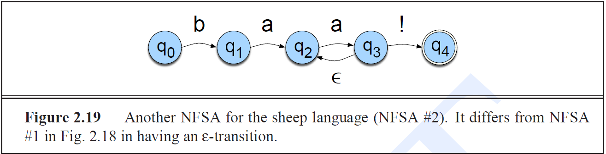

ⓒ JMC 2017

http://ling.snu.ac.kr/class/AI_Agent/

---

## Summary

+ Regular Expression
+ Finite State Automata
+ Edit Distance : 두 string의 유사성 판단
+ Minimum Edit Distance : 두 string의


---
---
---

## 20171030 4주차

**복습**.
forward 알고리즘은 dynamic programming의 일종이다.
best path는 viterbi 알고리즘으로 알아낸다.


**수업**.

**backward**:

(slept)

`휴식`

우리가 배우고 있는 것은 best path를 찾아서 사용하는 sequence classifier이다.

```
11/1(수) 시험 관련

- 3시간
- 배웠던 건 전부 (~04-1-Tagging.pdf p.35)
- 문제 수 많음
- 책, 컴퓨터 (o) 인터넷 (x)
- 공학용 계산기 필요
```

**POS tagging**:
이미 있는 전치사로 새로운 전치사를 만들 수 없으니 closed class이다.
fax 같은 동사는 기술의 발달로 등장한 새로운 동사이므로 open class이다.
구동사 give up의 up은 particle이다.
전치사와 구별이 힘들 수 있다.

Choosing a Tagset.
N, V, Adj, Adv로 Tagset을 너무 적게 한정하면 Noun 중에서 pronoun이라는 정보가 누락될 수 있다.
너무 많아도 문제이다.
많이 쓰는 Tagset은 'Penn TreeBank tagset'이다.
Treebank : 문장 구조 분석.
NLTK에도 있음.


---

## 20171025 3주차 :: 09 HMM

Finite State Automata 구분:
+ Moore Machine
+ Mealy Machine

우리가 알고 있던 FSA 는 Mealy Machine이다.
어떤 state를 보고 다음 state로 가는 것이 Mealy Machine.
input이 b이면 state q1에서 state q2로 옮겨간다.
그러면 output이 a가 된다.

한 상태에서 다음 상태로 나올 때 output이다.
output은 현재 input과 현재 state에 의존한다.
A Mealy Machine is an FSM whose output depends on the present state as well as the present input.

Moore Machine이 HMM의 근간이 되는 Machine이다.
output은 현재 state에만 의존한다.
Moore machine is an FSM whose outputs depend on only the present state.

??? 위 내용 재정리해야함

확률이 주어진, weight가 주어진 automata가 Markov Model이다.

내가 관심 있는 것은 'I hate this class'인데,

아이스크림 예제에서는 날씨라는 state가 hidden 되어 있었다.
그래서 Hidden Markov Model을 사용했다.
아이스크림 개수가 output이다.
아이스크림의 개수라는 output은 현재 상태에만 의존한다(output independence assumption).
각 state는 아이스크림의 개수를 방출할 확률인 emision probability가 정해져 있다.
하나의 state에서 emission probability의 합은 항상 1이다.

dynamic programming. minimum edit distance 구할 때 했다. dynamic programming이란 big problem을 sub-problem으로 쪼개서 반복 계산을 피하는 것이다.

`https://web.stanford.edu/~jurafsky/slp3/9.pdf`

**Viterbi**. 실제로 가능한 combination 중에서 가장 확률값이 높은 path를 어떻게 찾을 수 있을까?
observed data에 대한 path를 찾는 효율적인 방법 = Viterbi.

각 노드에 들어오는 값 중에서 더 큰 값만 max를 취한다.
max path만 찾으면 최종적으로 확률적으로 가장 큰 path를 찾을 수 있다.


---

## 20171025 3주차 :: 08 Maxent (2)

**복습**.
document의 class를 구분하는 문제.
generative model인 나이브 베이즈는 심플하고 independence assumption이 유지되는 상황에서 성능도 좋고, 여러 모델을 비교하기 위한 baseline(기준)으로 쓰이기도 한다.
그러나 double counting 문제가 발생한다.

discriminative model은 generative model보다 유리하다.
언어적인 feature를 넣을 수 있기 때문이다.
각각의 feature는 weight를 가진다.
feature는 actual counting도 있고 평균적인 기댓값(expectation) 두 가지가 있다.
이 두 가지 feature가 모델을 최적화하는데 사용된다.
feature가 적용되는지 안 되는지 binary problem으로 계산한다.

feature를 연산하는 방법.
feature를 classifier에 넣는 방법은 데이터에 feature가 존재하면 1, 없으면 0으로 binary 계산을 한다.
classifier에는 feature와 weight의 곱셈으로 계산한다.
feature를 계산할 때는 binary이므로 (0, 1)로 구분하기 위해서 log를 취한 logit function으로 바꾼다.
이를 확률 모델로 바꾸기 위해 exponentiate해서 normalize한다.
이때 normalize 방법을 softmax function이라 한다.

**수업**.
분류 작업을 처음 시작할 때는 소수의 feature를 발견한다.
그 후 새로운 feature를 발견할 때마다 feature를 add 한다.
feature를 add 한다는 것은 데이털르 설명하는 현상을 찾았다는 뜻이다.
처음에는 뭉뚝한 feature로 시작하다가 나중에는 데이터를 잘 설명하는 날카로운 feature를 찾아가는 방식을 maxent라고 한다.

tokenize할 때 나이브 베이즈는  'Hong Kong'처럼 항상 떨어져 있지만 실제로는 한 단어를 두 번 세는 double counting 문제가 있었다.
Maxent는 이런 double counting을 회피할 수 있다.

`03-3-Maximum_Entropy_Classifiers_All_new.pdf`

`p.31`
Monaco라는 단어가 나온 document를 Europ으로 분류할지 Asia로 분류할지 살펴보자.

prior:
+ $P(A)=P(E)= \frac{1}{2}$

likelihood:
+ $P(M|A) = \frac{2}{8} = \frac{1}{4}$
+ $P(M|E) = \frac{6}{8} = \frac{3}{4}$

posterior:
+ $P(M | A) \times P(A) = \frac{1}{2} \times \frac{1}{4} = \frac{1}{8}$
+ $P(M | E) \times P(E) = \frac{1}{2} \times \frac{3}{4} = \frac{3}{8}$

$\therefore$ Europe으로 분류

> **Note**: posterior : $P(d | c) \times P(c)$

`p.33`
나이브베이즈의 Hong Kong 분류

prior:

likelihood:

posterior:

`p.42`
maxent로 하면 actual count와 predict count가 최소화되는 feature를 찾을 수 있다.
좋은 feature를 add할 때마다 entropy가 줄어들고 actual data의 likelihood는 높아진다.

데이터의 형태를 모를 때는 uniform으로 가정하는 것이 가장 합리적이다.
feature를 add 하면서 점점 불확실성을 줄어들게 만들어라.
그러면 모델의 likelihood도 높아진다.

log likelihood로 생각하면 likelihood가 convex 형태가 되고, 데이터를 잘 반영하는 feature를 넣어가면서 entropy가 최소화되는 parameter를 찾는다.

`----------휴식----------`

`p.5` 반복.
나이브베이즈는 generative model이다.
주어진 document(데이터)의 class를 분류할 때, 나이브 베이즈는 ~한다.
discriminative는 여러 document가 있을 때 condition을 고려해서 class를 분류한다.
이때 document의 특징이 되는 feature를 설계해야 한다.

`p.49`
엔트로피는 분포의 불확실성을 측정하는 개념이다.
"surprise"는 확률이 높을수록 중요성이 떨어지므로 Px를 역수 1/Px로 취하고, 가법성의 법칙을 만족시키기 위해 log를 취한 것이다.
엔트로피는 "surprise"를 평균낸 것이다.

맨 처음에는 잘 모르니 uniform distribution으로 가정한다.
uniform한 상태에서는 maximum entropy가 된다.
데이터를 반영하는 constraint를 넣는다.
constraint = feature.
contstraint를 넣는다는 것은 maximum entropy를 낮춘다는 것이다.

단계:
1. entropy가 최대화되는 uniform distribution을 가정한다.
2. 그래야 maximum entropy가 된다.
3. 데이터를 반영하는 constraint, 즉 feature를 넣어서 entropy를 줄어들게 만든다.
4. 그러면 데이터에 대한 모델의 likelihood가 커진다.

`p.51`

+ left : 동전 던지기를 unifrom distribution으로 가정한다.
+ middle : 'head와 tail이 나올 확률의 합이 1이다'라는 constraint를 추가하고, constraint를 직선으로 그린다.
+ right : head가 나올 확률이 0.3 이라는 constraint를 추가한다.

`p.52~53`

+ event space : part of speech 6개의 class
+ empricial data : 총 36
+ Maximize H :
+ want probabilities : 맨처음에는 엔트로피가 가장 높은 uniform distribution으로 가정한다.
+ feature 설계 : 실제 데이터에 맞는 constraint를 찾아내서 적용한다. 이때도 uniform하게 가정한다. 자주 나오는 NN, NNS, NNP, NNPS에 32/36을 4개로 나누고, 나머지 값도 2개로 나눈다.
+ actual data를 반영하는 feature 추가 : 자주 나오는 NNP, NNPS를 24/36에서 동등하게(uniformly) 확률값을 분배한다.

`p.54`
위에서 이야기한 방법이 가능한 이유.
convexity.
개별 데이터 포인트에 weight와 feature가 있다.
슬라이드에 있는 upper bound 식은 convexity를 보장하는 방정식이다.

`p.61`

1. 일단 전체 합이 1이 되도록 uniform하게 분배한다. 그래서 1/4씩 분배한다.
2. Empirical 데이터를 보니 A가 전체 6개 중에 4번, 즉 4/6 = 2/3가 나오더라. 그러니 A의 값이 2/3가 되도록 A가 차지하는 두 칸에 1/3, 1/3씩 uniform하게 분배한다.
3. 같은 feature인 A에 대한 feature를 추가해도 A에 해당하는 칸에 다시 uniform 하게 나눠주기 때문에 distribution이 바뀌지 않는다.

나이브베이즈에서는 'Hong', 'Kong'을 한번씩 세므로 double counting이 되어 distribution이 바뀌었지만, Maxent에서는 feature가 overlap 되어도 다시 uniform distribution으로 만들어주기 때문에 distribution이 바뀌지 않는다.

나이브베이즈에서는 'Hong' 뒤에 'Kong'이 오는 것이나 'Kong' 앞에 'Hong'이 오는 것이나 같은 조건인데도 불구하고 개별적으로 counting하게 된다.

`시험 : 다음주 월요일 10/30까지 배운 내용으로 11/1 수요일에 시험 봄`

`----------휴식----------`

---

## 20171023 3주차 :: 07 Maxent (1)

`rec2`

`03-3-Maximum_Entropy_Classifiers_All_new.pdf`
지금까지는 generative model을 배웠다.
이제 배울 discriminative model은 성능이 더 좋다.

`p.5`
Joint(generative) model에서는 $P(c | d)$를 Bayes Rule로 구했었다.
class에서 feature가 나타날 확률을 연산.
discriminative model에서는 feature를 바탕으로 어떤 class에 속하는지 연산.

| NLP | generative model | discriminative model |
|---|---|---|
| feature | 언어적인 feature (x)  | 언어적인 feature (o) |

`p.10` discriminative model에서는 언어적인 feature를 더 넣기 쉽다.

`p.11` 나이브 베이즈는 언어적인 feature를 만들 수 없다.
discriminative model은 언어적인 feature를 임의로 만들 수 있다.
LOCATION, DRUG, PERSON을 분류하려고 한다.

+ $f_1$(feature 1) : ~하면 LOCATION으로 분류한다.
+ $f_2$ : 액센트가 붙은 라틴자가 있으면 LOCATION 분류가 된다.
+ $f_3$ : 어떤 단어가 C로 끝나면 DRUG을 분류될 수 있다.

> **Note**: $\wedge$ = and

나중에는 각각의 feature마다 weight(가중치)를 줄 수 있다.
이 weight를 학습하는 것이 굉장히 중요한데, weight를 조절하는 방법은 딥러닝에서 backpropagation하듯이 처리한다.
언어적인 현상을 feature에 넣어서 계산을해서 분류하는 모델이 discriminative model이다.
feature-based model.
이를 어떤 식으로 연산할지 Maxent와 logistic에 대한 이론적인 얘기를 해보자.

`p.12`
empirical = 실제의.
실제 acutal count와 모델에서의 expectation.
이 값이 최대로 되는 모델링을 한다.

`p.16`
**Maxent Classifier**.

`p.18`
우리가 지금 하는 것은 linear classifier이다.
딥러닝은 non-linearity를 찾아서 데이터를 잘 분류하는 것이다.
어떻게 feature를 만들고 classifier에 집어넣을지 알아보자.
중요한 점은 feature를 만들 뿐 아니라 feature에 대한 weight를 설정하고 weight를 학습하고, classifier의 연산에 넣겠다는 것이다.

`p.21`
linguistic feature에 따라 weight를 곱했던 score 값을 확률값으로 바꿔보자.
logistic model.

**끝.**

---

## 20171023 3주차 :: 06 Naive Bayes

**복습.**
가장 심플한 formal representation으로 regular expression 배웠음
두 단어 간의 형태의 유사성을 측정하는 edit distance 했음.
실제로 language modeling하는 n-gram 이야기했음.
Markov assumption.
그 다음에 정보이론으로 정보 측정하는 방법 이야기 함.
크로스 엔트로피.

본격적으로 classify 이론 배운다.
가장 심플한 naive-bayes부터 maximum-entropy, 그리고 speech에서 사용하는 HMM, 그리고 Tagging을 배우면 언어를 처리하는 기본적인 방법론 배우는 것.

그 다음은 구조.
구문 분석은 쉽지 않다.
한국어는 형태소가 복잡하므로 구문 분석 어려움.
한국어는 어순이 자유롭기 때문에 rule을 기술하는 게 쉽지 않음.

그 다음은 word2vec.
논문에 나온 것을 실제로 apply하는 것.
딥러닝 기반의 processing 하는 것을 예를 보고 실습할 것.

**수업**.
`03-1-naivebayes_short.pdf`
지난 시간 text classification 이야기 했었다.
작가 찾기, 글쓴 사람 여성/남성 찾기, 긍정/부정 review 구별하기 등등의 문제가 해당된다.

**Naive Bayes Intuition**.
확률에 기반한 방법.
Bayes Rule에 의해서 나이브(심플)하게 클래스하는 방법이다.
나이브 베이즈의 가장 큰 특징은 Bag of Words이다.
Bag of words는 특징이 될 만한 단어를 bag에 넣어둔 것이다.
구조적인 정보나 언어적인 정보는 무시하고 중요한 단어만 넣어두고 중요한 단어가 얼마나 많이 나왔냐를 고려하는 것.
언어적 정보를 무시하고 다만 이 단어가 얼마나 나타났느냐를 따지는 방법.

대부분의 텍스트에 등장하고 classification 하는 데 도움이 되지 않는 단어를 stopwords라고 한다.
그러나 텍스트의 성격에 따라 stopwords를 잘 골라서, 실제 classification 때 날려버려야 한다.
뜻이 있는 단어는 content word라고 한다.

수학적 계산. `p.22`

+ Posterior : $P(c | d)$.
  + document $d$가 왔을 때 class $c$일 확률.
+ Bayes Rule : $P(c | d) = \frac{P(d | c)P(c)}{P(d)}$.
  + 사전확률 $P(c)$는 쉽게 구할 수 있음.
  + 중요한 것은 $P(d | c)$를 어떻게 구할까.


**$P(d | c)$를 구하는 아이디어**.
document $d$를 document에 들어 있는 feature ($x_1, x_2, \cdots, x_n$)로 represent한다 (generalize, generative model).

우리의 모델.
$P(x_1, x_2, \cdots, x_n | c)$.
각각의 class가 주어졌을 때 어떤 feature가 등장할 확률.

assumption:
  + Bag of Words : 문장의 위치는 중요하지 않다.
  + conditional independence : 특정한 글의 특정한 feature는 모두 independent하다. 그래서 시퀀스를 연쇄적으로 곱해나갈 수 있다.
    + $P(x_1, x_2, \cdots, x_n | c) = P(x_1 | c) \times \cdots \times P(x_n | c)$

실제로 언어 structure가 independent 할까?
그렇지 않을 수 있다.
자주 쓰는 단어 조합인 collocation도 그렇고 특정한 품사 뒤에 특정한 품사가 나올 수 없는 rule을 고려해봐도 independent라고 하기 어렵다.
특정 단어가 나오면 다음 단어가 100% 나올 경우도 independent라고 할 수 없다.
이런 문제가 나올 수 있다.
그렇지만 굉장히 심플하고 빠르게 작동하고, 실제 데이터에 가장 큰 확률을 찾으므로 장점이 많다.
실제 classification work에서는 가장 기준이 되는 성능으로 삼는다.

정리하면, 나이브 베이즈는 베이즈룰을 적용시켜서 classification 한다.
... 확률을 최대화하는 것을 구한다.
두 가지 assumption이 있었다.

`p.27`
나이브 베이즈는 사실 확률을 다 곱하는 것이다.
가령, 경제 class가 나올 확률에다가 경제 class의 feature를 모두 곱해서 argument를 maximize하는 값을 취한 후, 거기에 해당하는 class가 최종 class가 된다.


`p.31`
실제로 나이브 베이즈의 확률을 어떻게 구하느냐.
특정 class가 나타날 확률은 전체 document 중에서 해당 class가 나타나는 수로 나눈다.
정치 class에서 어떤 단어가 나타난 수를 다 counting한 것으로 전체 등장한 단어수로 나눠서 확률을 구한다.
$w \in V$에서 $V$는 word type을 말한다.

zero-count smoothing.
N-gram에서 특정한 단어가 topic에 나타나지 않았을 때, 즉 특정 확률이 0이 되면 전체가 0으로 만들기 때문에 문제가 되었다.
여기서도 마찬가지므로 조절을 해야 한다.
어떻게 하면 될까?
여러 가지 방법이 있다.
라플라스 스무딩인 add-1을 한다.

`p.36`
unknown word는 어떻게 할까?
vocabulary에 $w_u$을 추가한다.

`p.39`
$P(c | d)$가 우리가 하고자 하는 일.
그런데 나이브 베이즈에서 이게 전환된다.
$P(d | c) \times P(c)$가 된다.
feature를 모두 곱한 것이다.
china라는 class가 있었을 때 shanghai라는 feature가 등장할 확률이란,
결국 china class에서 shanghai 라는 feature가 어떤 확률로 generate 되는지 연산을 하는 모델이 되는 것이다.
이는 이후 살펴볼 discriminative 모델인 maximum-entropy와 반대되는 관점이다.

`p.40`
나이브 베이즈는 어떤 feature라도 쓸 수 있다.
가령, URL이나 이메일 주소를 feature로 넣고 이 주소가 있느냐 없느냐를 따질 수 있다.
주로 word feature를 쓴다.
그래서 나이브 베이즈는 language modeling과 거의 똑같다.
language modeling에서 특정 sentence의 확률을 구하기 위해 markov assumption을 썼다.
앞에 단어가 나올 확률과 다음 단어가 나올 확률을 곱하는 그런 방식이었다.
이러한 점이 나이브 베이즈와 굉장히 유사하다.

`p.41~42`
unigram으로 language modeling.
positive class에 있을 때 'I'가 등장할 확률은 0.1.
P(d | c) * P(c)여야 한다.
P(s|pos)와 P(s|neg) 계산할 때, P(positive)=P(negative)=1/2이므로 생략되었다.

`p.45`
실제로 계산해보기.

`p.46`
**Double Counting**.
independence Assumption이 실제 언어 처리에서 나타는 문제.
perfect하게 dependent한 경우를 떠올리면 된다.
'San Francisco', 'Hong Kong' 같은 경우 형태로는 떨어져 있지만 의미적으로는 완전히 하나의 단어이다.
나이브 베이즈로 Hong Kong을 counting 하면 Hong 한 번 카운팅하고, 따로 Kong을 한 번 카운팅한다.
즉, 하나의 단어에 대한 double counting의 문제가 발생한다.
확률값에 영향을 미치므로 Classification에 문제가 생길 수 있다.

나이브베이즈.
그래도 많이 쓴다.
꽤 잘 work 한다.


---

## 2주차 :: 05 Text Classification


---

## 2주차 :: 04 엔트로피

### 복습

언어 모델링하는 N-gram을 배웠었다.
어느 corpus를 갖다 줘도 smoothing을 통해서 찾고 싶은 문장에 대한 확률을 estimation할 수 있었다.
어느 특정 단어가 많이 나타나는지를 확률을 통해 계산할 수 있었다.
가장 간단한 uni-gram부터 할 수 있고 성능이 낮다면, 특정한 sequence인 bi-gram을 사용해서 성능을 높일 수 있다.

### 정보량

정보량.
첫번째, 정보량에서는 중요성이 중요하다.
중요성을 계산할 때 사건의 확률을 연관시킬 수 있다.
어떤 사건이 일어날 가능성이 작을수록 그 사건은 많은 정보를 가진다.
뒷면이 나올 확률이 99/100이라면, 정보량의 관점에서는 중요하지 않다.
왜냐하면 예측이 되고 미리 판단할 수 있기 때문이다.
확률의 크기에 따른 중요성의 법칙은 아래 식으로 표현된다.

$P(x_1) > P(x_2) \Rightarrow I(x_1) < I(x_2)$

두번째, 정보량에는 가법성(덧셈)의 성질이 있다.
두 정보의 정보량은 곱셈이 아니라 덧셈이다.

중요성과 사건의 확률의 관계는 반비례하므로 이 성질을 이용하려면 역수의 관계로 설정하면 된다.
그런데 역수의 관계로 설정된 상태에서는 가법성의 법칙이 충족되지 못한다.
그래서 log를 취해서 가법성의 법칙을 충족시킨다.

$I(x) = \frac{1}{P(x)} = \log{\frac{1}{P(x)}} = - \log{P(x)}$

정리하면, 정보의 중요성 $I(x)$는 확률 $P(x)$에 $- \log$를 취한 $-\log{P(x)}$형태가 된다.
확률의 관점에서 정보량을 표시한 것이다.

### 엔트로피

전보를 칠 때는 용량이 제한되어 있으므로 정보를 최대한 압축시켜야 했었다.
정보를 어떻게 압축할 수 있을까.
제한된 통신선에서 가장 효율적으로 데이터를 압축시키는 모델을 수학적으로 만든 것이 엔트로피이다.

엔트로피 $H(x)$는 확률변수 x가 각각 일어날 확률 $p(x)$에다가 확률의 정보량 $-\log{P(x)}$를 곱한 것을 모두 합한 것이다.
수식을 보면, 주사위의 눈이 나올 평균값과 같은 형태를 갖고 있다.
따라서, 엔트로피는 특정 이벤트(확률변수)가 가질 수 있는 평균적인 정보량을 의미한다.

### 엔트로피의 성질

엔트로피에 어떤 성질이 있는지 알면 cross-entropy, maximum-entropy를 이해하는 데 큰 도움이 된다.

성질1 self-information.
$H(x)$의 값이 클수록 불확실성이 크다는 말이다.
$H(x) = 0$이라는 것은 확률값 $p(x)$가 1이라는 것, 즉 100% 확실하다는 뜻이다.
따라서 엔트로피는 불확실성을 측정하는 값이다.

동전 던지기에서 엔트로피가 최대가 되는 경우는 앞뒤가 나올 확률이 똑같을 때이다.
한 쪽으로 조금이라도 쏠려야 예측하기가 쉬워지는데, 두 개가 발생할 확률이 똑같으면 무엇이 나올지 예측하기 어렵기 때문이다.
확률값의 균형이 깨지는 순간 엔트로피는 낮아지게 된다.
확률값이 동일(uniform distribution)할 때 엔트로피는 가장 높아지게 된다.

성질2 bit의 특징.
base를 2로 두면 비트수로 생각할 수 있다.
엔트로피는 어떤 정보를 코딩했을 때 평균적으로 최소한으로 필요한 비트 수를 알려준다.

성질3 search space.
정답을 찾기 위해 질문을 던질 때 좋은 분류 기준을 찾을 수 있다.
확률이 높은 것을 먼저 인코딩할 수 있다.
대표적으로 허프만 인코딩이 그렇다.

### 크로스 엔트로피

언어의 엔트로피는 어떻게 구할 수 있을까.

`(4.59)`

simplify해서 log 확률로 구한다.
`Jurafsky 2ed p.126 (4.60)`


크로스 엔트로피.
엔트로피보다 실제로 많이 쓰이는 것은 크로스(비교 또는 교차) 엔트로피이다.
긴 언어의 연쇄에 대한 확률을, 모델을 구하기 어려운 경우가 많다.
우리는 실제로 actual event 대신에 그것을 반영하는 모델의 확률을 쓴다.
(두 가지 식 `(4.59)`와 `(4.61)` 비교해보면 알 수 있다)
모델의 교차적인 엔트로피가 크로스 엔트로피이다.
$$\log{p}$를 모르기 때문에 그것을 반영하는 모델(ex. bigram)을 설정하고 그 모델의 확률을 쓴다.

$H(p,m) = \lim_{n \rightarrow \infty} - \frac{1}{n} \log{m(w_1, \cdots ,w_n)}$

최상의 모델이라면 실제 엔트로피를 그대로 반영해야 한다.
따라서 최선의 경우는 $H(p) = H(p, m)$이다.
모델 하나가 내놓는 엔트로피로는 좋은 모델인지 알 수 없다.
그래서 여러 모델이 내놓는 엔트로피를 비교하여, 즉 크로스 엔트로피를 사용해서 가장 엔트로피가 낮은 모델을 선택한다.

반복하면, 크로스 엔트로피는 확률 $p(x)$에다가 모델링의 확률 $\log{m(x)}$을 곱한 것이다.
모델링이 얼마나 잘 되었는지 살펴보고 검증할 수 있는 방법론이다.

### 자율과제 :: 세종 코퍼스 크로스 엔트로피 계산하기

http://ling.snu.ac.kr/class/AI_Agent/CrossEntropyExcercise.html

[직접 인용]

힌트:sejong.nov.train 코퍼스에서 유니그램의 경우 자소별 유니그램 빈도를 구한 후 이를 각각 전체 자소 유니그램 수로 나누면 이것이 유니그램  확률이 된다.  이 글자의 확률을 엔트로피 공식에 넣어 계산하면 유니그램 글자 기반의 엔트로피가 된다. 따라서 sejong.nov.train의 경우는 엔트로피와 크로스 엔트로피가 같고 그 차이도 0이 된다.

이 모델을 sejong.nov.test 와  hani.test  코퍼스에서 테스트 하기 위해 마찬가지로 각 자소별 확률을 구하고 이를 교차 엔트로피 공식에 따라 구하면 되는데, 이 경우 $P(x)$는 이 test 코퍼스의 각 글자별 확률이고 모델의 확률인 $\log p(m)$은 training 코퍼스인 sejong.nov.train코퍼스에서 구해진 각 자소의 확률이다. 각 자소별로 이를 다 곱해서 더 하면 교차엔트로피가 구해진다. 엔트로피와 교차엔트로피의 차이는 $H(P,m) - H(p)$로 그 차이가 작을수록 더 좋은 모델이 된다. 이 경우 training 코퍼스에 없는 n-gram 자소가  test 코퍼스에 있을 경우 어떻게 할 지를 생각해 보라.

`NLTK ch.6 :: 4.1 Entropy and Information Gain`

### perplexity

$$perplexity(W) = 2^{H(W)}$$

perplexity는 엔트로피와 차이가 없다.
2의 거듭제곱 형태로 나타낸 것뿐이다.
엔트로피와 의미가 같다.
다만, perplexity를 사용하면 2의 제곱으로 계산하기 때문에 성능의 개선 정도가 엔트로피를 사용할 때보다 뻥튀기 된다.
speech 쪽에서 엔트로피 대신 perplexity를 사용해서 성능 개선의 정도를 뻥튀기해서 연구비를 많이 받았다더라는 카더라가 있다더라.

`11월1일 NLP 시험`

---

## 2주차 :: 03 Word Prediction

단어 예측하는 알고리즘으로 N-gram이 있다.
N-gram은 앞에 단어를 토대로 뒤에 나올 단어를 예측하는 알고리즘이다.
N은 token의 개수, 즉 개별적인 단어의 개수를 뜻한다.
1개의 단어만 보고 뒤에 단어를 예측하면 1-gram(uni-gram)이라고 한다.
연속된 2개의 단어만 보고 뒤에 단어를 예측하면, 2-gram(bi-gram)이라고 한다.

N-gram 알고리즘은 그 다음 단어가 나올 확률을 알아내기 위해서 빈도를 계산한다.
다음과 같이 conditional probability를 사용한다.
$P(w_i | w_{i-1})$

N-gram은 기본적으로 확률을 구하는 모델링이기 때문에 next word를 예측할 때 유용한 알고리즘이다.
Language Modeling에서도 앞의 singnal을 보고 뒤의 signal을 예측하는 것인데 원리가 같다.

언어의 확률값을 가장 정확하게 구하는 방법은 counting이다.
그래서 counting이 중요하다.
그런데 word tokenization이나 sentence tokenization 모두 counting이 쉽지 않다.

2-gram으로 예시를 들어보자.
"He stepped out into the hall, was dleighted to encounter a water brother."
He가 주어이고 brother가 문장 마지막인지 알기 위해 눈에 보이지 않지만 start, end 표시가 있다고 생각한다.
따라서, (start, He), (He, stepped) .... (water, brother), (brother, end)로 14쌍이 나온다.

counting할 때는 token과 type을 counting한다.
실제로 나타난 개별적인 단어는 token이라고 하고, unique한 token의 종류를 type이라고 한다.

wordform에 따라 count의 기준이 달라질 수 있다.
cat과 cats는 따로 세야 할까?
Lemma는 cat과 cats이 cat이라는 lemma로 묶이므로 따로 세지 않는다.
Wordform은 cat과 cats를 별도의 단어로 센다.
대부분의 경우는 wordform 단위로 작업을 한다.
왜냐하면 Lemmatization하는 것이 어렵기 때문이다.
가령 goose와 geese가 같은 lemma인지 알기 어렵다.

> **Note**: Lemma : stem, major part of speech, rough word sense가 같은 단어

우리가 하려는 것은 단어의 확률을 구하는 것이다.
단어의 확률을 구하는 이유는 다음 단어를 예측하기 위해서이다.
확률을 구할 때는 실제로 특정 단어 뒤에 어떤 단어가 몇 번 나오는지 counting을 해서 계산한다.
확률은 어느 자료에서 구할까?
Corpora(Corpus의 복수형)에서 구한다.

Language Modeling이란 무엇일까.
'새빨간 ____'를 맞추는 것처럼, 앞 단어 sequence를 가지고 다음 단어를 predict하는 확률적인 모델을 language modeling이라 한다.
`<--휴식-->`

$P(w_i | w_{i-1})$를 사용해서 실제로 확률을 구해보면 잘 안된다.
긴 연쇄를 corpus에서 찾는 것은 매우 드물고 있더라도 biase되어 있을 확률이 높다.
biase되어 있다는 것은 한 문서에 쓰인 문장이 다른 곳에서 등장하는 경우 여러 곳에서 자주 쓰인다고 볼 수 없는 경우를 뜻한다.
실제 corpus에서 우리가 긴 연쇄를 찾으면 거의 없다보니 0이 될 확률이 높다.
다른 방법을 사용해야 한다.
'신효필은 천재다'를 찾는 것보다 '신효필', '천재'를 break해서 찾는 것이 낫다.
그러니 chain rule을 쓰자.
$P(A | B) = P(A, B)/ P(B)$

chain rule을 사용하면 다음과 같이 정리된다.
"P(its water was so transparent) = P(its) * P(water | its) * P(was | its water) * P(so | its water was) * P(transparent | its water was so)"
그런데 여기에도 문제점이 있다.
쪼깨진 P중에 하나가 0이 되면 전체 확률이 0이 되어버리거나, 결국 가장 뒤에 있는 conditional probabilty에서는 긴 연쇄가 등장할 수밖에 없기 때문에 긴 연쇄를 찾는 어려움이 또 등장하게 된다.

그래서 independent assumption을 사용한다.
이는 앞에 나온 단어는 뒤에 나온 단어와 independent하다는 가정을 말한다.
이를 Markov assumption이라고 한다.
Markov 가정에서는 보통 bi-gram으로 사용한다.

$$P(w_i | w_{i-1}) = \frac{count(w_{i-1}, w_i)}{count(w_{i-1})}$$
예를 들면, "P(거짓말 | 새빨간) = P(새빨간, 거짓말) / P(새빨간 uni-gram)"

실제 counting에 바탕을 두었기 때문에 참고한 corpus에서 최대가 되는 값을 찾았으므로 Maximum Likelihood Estimates가 된다.  

bi-gram estimation 끝.

bi-gram을 보면 조악해보이지만 직관적으로 일치하는 경우가 많다.
`슬라이드 p.30`을 보면 N-gram이 world knowledge나 language knowledge를 반영하고 있다고 볼 수 있다.

`슬라이드 p.33` N이 높아질수록 불확실성 entropy가 줄어든다.

`슬라이드 p.34` bi-gram 확률 중 중간에 0이 나타나면 smoothing을 해야 한다. `<--휴식-->`

우리가 어떤 corpus에서 학습을 해서 language modelingm을 만들고 나면 모델을 evaluation을 해야 한다.
evalulation은 information theory의 entropy 또는 cross-entroy를 통해 수행한다.
corpus 데이터에서 training data와 test data를 8:2로 나눴을 때,
training data에 없는 단어가 test data에 나오면 `<UNK>`(unknown)로 표시한다.

### Zero-Count Smoothing

`@p.34` 대부분의 bi-gram이 존재하지 않는 경우가 있다.
어떤 경우에 대한 count가 0일 때 어떻게 대응해야 할까?
Zipf의 법칙에 따르면, 소수의 단어가 빈도수가 매우 높다.
대다수의 단어는 빈도수가 낮다.
또 대다수의 단어는 쓰이기까지 시간이 꽤 걸릴 수도 있다.
그래서 0이 나타나는 현상을 보조, 즉 smoothing 해야 한다.

Laplace Smoothing.
모든 type에 count를 +1을 더한다.
$P_{Laplace}(w_i)=\frac{c_{i}+1}{N+V}$.
Laplace Smoothing의 의미는 counting 개수가 많은 것에서 빼앗아서 count 개수가 없는 것에 나눠준 것과 같다.
실제로 계산해보면 `@p.45` 참조.
type수가 많을수록 V값이 커지고 discount ratio가 커져서 original count에 통계적 왜곡이 크게 발생한다.

`@p.51` Good-Turing.
count가 없다가 새롭게 등장한 type에 +1을 더한다.
한 번도 안 나타난 type은 1로 초기화한다.
문제는 실제로 1번 잡힌 물고기는 원래대로라면 1/18인데
확률의 총합은 1이고 count 없는 것에 확률을 할당했으니, 1/18보다 작아져야 한다.
...
Laplace Smoothing에 비하면 Good-Turing은 adjusted ratio의 비율이 훨씬 더 합리적으로 조절된다.

Backoff.
bi-gram 없으면 uni-gram으로 backoff 해라.
우리가 원하는 것은 '이 수업이 재미있다'인데, '이 수업'이라는 bigram이 없으면 '수업'이라는 uni-gram을 사용하면 의미가 완전히 달라질 수 있다.
왜냐하면 '저 수업' 또는 '그 수업'이 될 수도 있기 때문이다.

`@p.66` Practical Issues.
대부분의 bi-gram은 소수점이 6개 정도 등장할 정도로 확률 값이 매우 낮다.
그 수를 계속 곱셈하면 0의 개수가 너무 늘어나서 overflow로 계산을 못하게 된다.
그래서 실제로 계산할 때는 log를 취해서 덧셈으로 바꾼다.
마지막 값에 exponentiate하면 원래 값을 구할 수 있다.

대부분의 과제 작업에서는 add +0.5를 하면 된다.

**수업끝.**

---

## stanford NLP :: 3-1 Defining Minimum Edit Distance (to 3-3)

`jurafsky 3.11`

**minimum edit distance**:
두 문자열이 같아지기 위해서 거쳐야 하는 최소의 편집 개수를 말한다.
여기서 편집이란 3가지 연산으로 구성되는데 insertion, deletion, substitution을 말한다.
각 연산은 cost를 발생시키고, 최소 cost가 곧 최소 편집 거리(minimum edit distance)가 된다.
Levenshtein distance를 사용하면 insertion, deletion은 cost=1, substitution은 cost=2로 계산한다.

> **Note**: insertion: 삽입(add), deletion : 삭제, substitution : 대체

최소 편집 거리는 다이나믹 프로그래밍으로 계산한다.
다이나믹 프로그래밍은 작은 문제(subproblem)를 푸는 방법을 활용해서 큰 문제(big problem)를 푸는 표 기반(table-driven) 알고리즘을 말한다.
Viterbi, forward 알고리즘과 같이 음성 인식과 자연어처리에서 흔히 사용하는 방법이다.
다이나믹 프로그래밍은 표 기반이므로 tabular computation 방식으로 설명할 수 있다.

**Tabular Computation**:
| N | **9** |   |   |   |   |   |   |   |   |   |
|:---:|---|---|---|---|---|---|---|---|---|---|
| O | **8** |   |   |   |   |   |   |   |   |   |
| I | **7** |   |   |   |   |   |   |   |   |   |
| T | **6** |   |   |   |   |   |   |   |   |   |
| N | **5** |   |   |   |   |   |   |   |   |   |
| E | **4** |   |   |   |   |   |   |   |   |   |
| T | **3** | 4 (INT → E) | 5 (INT → EX) | Question |   |   |   |   |   |   |
| N | **2** | 3 (IN → E) | 4 (IN → EX) | 5 (IN → EXE) |   |   |   |   |   |   |
| I | **1** | 2 (I → E) | 3 (I → EX) | 4 (I → EXE) |   |   |   |   |   |   |
| # | **0** | **1** | **2** | **3** | **4** | **5** | **6** | **7** | **8** | **9** |
|   | # | E | X | E | C | U | T | I | O | N |

0. 기준점
    + D(1,1) = D(I→E) = substitution = 2
1. 위로 이동
    + D(2,1) = D(IN → E) = D(I → E) + delete-source(N) = D(1,1) + 1 = 3
    + D(3,1) = D(INT → E) = D(IN → E) + delete-source(T) = D(2,1) + 1 = D(1,1) + 1 + 1 = 4

2. 오른쪽 이동
    + D(1,2) = D(I → EX) = D(I → E) + insert-target(E) = D(1,1) + 1 = 3
    + D(1,3) = D(I → EXE) = D(I → EX) + insert-target(E) = D(1,2) + 1 = D(1,1) + 1 + 1 = 4

3. 대각선 우상단 이동
    + D(2,2) = D(IN → EX) = D(I → E) + substitute-both(N/X) = D(1,1) + 2


Question:

+ D(3,3) = D(INT → EXE)
    1. 위로 이동 = D(IN → EXE) + insert(T) = D(2,3) + 1 = 6
    2. 오른쪽 이동 = D(INT → EX) + insert(E) = D(3,2) + 1 = 6
    3. 대각선 우상단 이동 = D(IN → EX) + substitution(T != E) = D(2,2) + 2 =  6

Answer:

+ D(3,3) = min(1, 2, 3) = 6

**Code**:

+ 초기화
    + $D(i,0)$ = $i$ (source-deletion을 $i$번 하므로 cost=$1 \times i$)
    + $D(0,j)$ = $j$ (target-insertion을 $j$번 하므로 cost=$1 \times j$)

```python
# python은 0-indexed이지만, 여기서는 NLP 책 예제와 같게 하기 위해 (1-indexed)로 설정

# initialize
D(i, 0) = i
D(0, j) = j

# edit operation = D(?,?) + cost
delete-source = D(i-1, j) + 1    # if done, it becomes D(i,j)
insert-target = D(i, j-1) + 1    # becomes D(i,j)
substitution = D(i-1, j-1) + 2 if X(i) != Y(j) else D(i-1, j-1) + 0    # becomes D(i,j)

for i in range(len(X)):
    for j in range(len(Y)):
        D(i,j) = min(delete-source, insert-target, substitution)
```

**Full Answer**:




**Backtrace for Computing Alignments**:
하지만 지금과 같이 최소 편집 거리(= MinEdit)를 계산하는 것이 매우 비효율적이다.
그래서 backtrace를 사용한다.
backtrace를 사용하면 두 문자열 간에 배열이 동일한 문자는 무엇이고, insertion 또는 deletion 또는 substitution이 필요한 문자쌍이 무엇인지 한 눈에 알 수 있다.



`[3-3 Backtrace] #inProgress`
https://www.youtube.com/watch?v=iQVp4Mq6s6k&list=PL6397E4B26D00A269&t=353

---

## 1주차 :: 02 Finite State Automata

FSA는 regular expression을 실행시키는 도구이자, 언어 처리에서 중요한 기본 개념이다.
FSA는 language의 structure를 구현하는 flow이다.
FSA가 언어 처리에서 중요한 이유는 FSA가 컴퓨터의 회로로 구현할 수 있는 일종의 설계도이기 때문이다.

**FSA**: 유한(finite) 개의 state와 transition을 가진 automata(기계, 회로, 알고리즘)

**RE to FSA with sheeptalk**: regular expression은 FSA로 mapping 된다.

+ sheeptalk : baa! baaa! baaa! ... baaaaaa!
+ regular expression : `/baa+!/`
+ fsa : 

sheeptalk에 대한 fsa가 완성되었다.
위 fsa는 어떤 intput이 오느냐에 따라 어느 state로 이동해야 할지 이미 결정되어 있다.
가령, $q_1$은 $a$라는 input이 오면 $q_2$로 넘어가고 다른 input이 들어오면 아무런 동작도 하지 않는다.
이렇게 input에 따라 action이 정해진 fsa를 deterministic 알고리즘이라고 한다.
추후 배울 non-deterministic automata는 어떤 state로 이동해야 할지 정해져 있지 않으므로 반드시 결정이 뒤따른다.


**FSA as a model**:
FSA도 일종의 모델이다.
이러한 언어 모델은 string을 생성하는 알고리즘으로 사용할 수도 있고, 인식하는 알고리즘으로 사용할 수도 있다.
언어 모델을 $m$이라고 하면 $m$에 의해 characterize 되는 symbol의 조합을 formal language라고 하며, $L(m)$으로 나타낸다.
formal language는 유한 개의 문자로 구성되는 string set이다.
가령, sheeptalk에 대한 formal language는 다음과 같이 정의된다.

$$L(m) = \{baa!, baaa!, baaaa!, \cdots \}$$

**Formal Language vs. Natural Language**:
사람이 실제로 말하는 언어를 natural language라고 한다.
formal language는 natural language와 전혀 다를 수 있다.
중요한 점은 formal language는 natural language를 모델링하는데 사용된다는 점이다.
phonology, morphology, 또는 syntax와 같은 natural language의 특징을 모델링할 수 있다.

**Deterministic vs. Non-deterministic**:



$q_2$에서 input $a$가 왔을 때, $q_2$로 갈지 $q_3$으로 갈지 정해지지 않았다.
이러한 decision-point가 존재하는 FSA를 NFSA(Non-deterministic FSA)라고 한다.



NFSA의 또 다른 주요 형태는 위와 같다.
화살표에 symbol이 없고 epsilon이 있는데 이러한 움직임을 $\epsilon$-transition이라 한다.
해석하자면, $q_3$에 있을 때 어떤 input 없이도 $q_2$로 이동할 수 있다는 뜻이다.
즉, $q_3$에서는 ! 화살표(arc)로 갈지 $\epsilon$-transition을 할지 정해지지 않았다.

실제 자연어에서는 non-deterministic한 경우가 많다.

**Summary**:
이번 장에서는 언어 처리에서 가장 중요한 기본 개념인 finite state automta와 automaton을 기반으로 하는 실용적인 도구인 regular expression을 배웠다.

+ regular expression은 강력한 패턴 매칭 도구이다.
+ regular expression은 finite state automata로 구현할 수 있다.
+ automaton은 automaton이 받아들일 수 있는 string의 조합으로 formal language를 정의한다.
+ deterministic FSA는 현재 state에서 어떤 input을 받든지 어떻게 처리해야 할지 이미 정해져 있다.
+ non-deterministic FSA는 현재 state에서 어떤 input을 받았을 때 선택할 수 있는 여러 가지 길 중에서 결정해야 할 때가 있다.
+ NFSA는 DFSA로 바꿀 수 있다.
+ NFSA가 길을 선택하는 방법은 두 가지로 나뉜다.
    + agenda-to-stack인 경우 LIFO 또는 depth-frist search
    + agenda-to-queue인 경우 FIFO 또는 breadth-first search라고 한다.

---

### Problems of non-deterministic

+ choice point에서 어떤 결정을 해야 할지 문제가 생긴다.
  + 선택의 분기점마다 표시를 해두고 특정 길로 갔다가 백업하여 다른 길로 하나 하나씩 다른 path를 모두 찾아간다.
  + 미리 앞의 state를 살펴보고 결정한다.

### Recognition as search

+ recognition 과정은 결국 가능한 combination을 모두 펼쳐 놓고 일일이 체크한다.
+ 이러한 recognition은 인공지능에서 search 문제로 볼 수 있다.

### p.39

+ NFA : 입실론 무브먼트 포함하는 오토마타

### Sum

+ 지금까지 한 게 formal representation이다.
+ 가장 간단한 방법이 Regular Expression이고 이것을 구현한 것이 FSA이다.
+ FSA는 그대로 컴퓨터 회로에 구현할 수 있다.

**끝.**

---

## Stanford NLP :: 2-4 Word Normalization and Stemming

tokenization 이후에 normalization을 해야 한다.

**Need to "normalize" terms**: Information Retrieval : indexed text & query terms must have same form. e.g. we want to match U.S.A. and USA

---

## Stanford NLP :: 2-3 Word Tokenization

+ Lemma : same stem, part of speech, rough word sense
  + cat and cats = same lemma
+ Wordform : the full inflected surface formal
  + cat and cats = different wordforms

**How many words?**:

"they lay back on the San Francisco grass and looked at the stars and their"

+ **Type** : a unique element of vocabulary
+ **Token** : an instance of that type in running text

San Francisco를 하나로 세면 14 tokens, 두 개로 세면 15 tokens.
13 types (or 12)(or 11)s.

**notation**:

+ $N$ : number of tokens
+ $V$ : set of types = vocabulary

**Issues in Tokenization**:

Before  | After (matter of choice)
--|--
Finland's captial  |  Finland Finlands Finland's
what're, I'm, isn't  | What are, I am, is not
Hewelett-Packard  |  Hewlett Packard
San Francisco  |  one token or two


---

## 1주차 :: 01 Regular Expression

인간의 언어를 컴퓨터에게 이해시키는 formal representation의 한 가지 방법으로 Regular Expression을 사용할 수 있다.

> **Note**: 촘스키의 언어 표현 단위에 따르면 가장 작은 단위인 regular expression을 포함한 4가지가 있다.

어떤 기호를 가지고 패턴을 만들면 원하는 search string을 찾을 수 있다.
이러한 패턴을 regular expression이라 한다.

| Pattern | Matches | 기능 |
| --- | --- | --- |
| `/[aA]/` | a 또는 A | disjunction  |
| `/[A-Za-z]/` | ABCDEFG...Zabcdefg...z에 해당하는 모든 single character | range |
| `/[^A-Z]/` | A-Z가 아닌 모든 single character | negation |
| `/[e][^f]/` | e로 시작하고 뒤에는 f가 아닌 two strings | some included, others excluded |
| `/[b]a+!/` | baa! or baaa! baaaa! | repetition |
| colou?r | color colour  | optional previous char  |
| oo*h!   | oh! ooh! oooh! ooooh!   | 0 or more of previous char  |
| oo+h!   |  same as the above  | 1 or more of previous char  |
| o{3,4}h! | oooh! ooooh!  | from 3 to 4 occurence of previous char |
| o{3,}h! | oooh! ooooh! ooooooooh!  | at least 3 occurence of previous char |
| beg.n   | begin begun began beg3n  | dot means any character  |
| cat\|dog  | cat and dog  | disjunction  |
| ^my   | starting any strings with 'my'  | anchor  |
| did.$   | ending any strings with 'did'  | anchor  |

> **Note**: range를 쓸 때는 from A와 to B를 명확히 이해할 필요가 있다. 가령, `/[A-z]/`의 경우 특수문자까지 매칭된다. 아스키코드를 보면 A-Z와 a-z 사이에 특수문자가 포함되기 때문이다.

**Advanced Operators**:

| Pattern | Expansion | Matches |
| --- | --- | --- |
| \d | [0-9] | any digit  |
| \D   | [^0-9]  | any non-digit  |
| \w   | [a-zA-Z0-9_]  | any alphanumeric or underscore  |
| \W   | [^\w]  | a non-alphanumeric  |
| \s   | [blank\r\t\n\f]  | whitespace (space, tab)  |
| \S   | [^\s]  | Non-whitespace  |

Regular Expression에서 알아야 할 것들.

+ Hierarchy 매칭 우선순위가 존재한다
+ 불필요한 내용까지 greedy하게 검색되지 않도록 세밀하게 패턴을 만들어야 한다.

**끝.**

---

## 00 Introduction (2)

**NLP가 크게 각광을 받게 된 이유**

+ IBM Watson이 인간을 꺾고 Jeopardy 우승

**Sentiment Analysis 감정 분석 / 의견 분석**

- 영화평, 상품평이 negative한지 positive한지 분류
- 온라인상에 엄청난 리뷰들이 올라오는데 이러한 의견을 자동으로 분석해보자.
- 기업의 경우 sentiment analysis가 매우 중요하다. 유저들의 반응을 실시간으로 살펴가며 흐름을 아는 게 고객관리 차원에서 매우 중요하기 때문에.
- 이슈들이 어떻게 변화되어 가는지 sentiment analysis로 알 수 있다.

**QA가 어려운 이유**

- domain이 제한되어 있지 않으므로 질문을 이해하거나 답변을 찾아야 할 범위가 너무 넓음
- 질의 자체를 이해하는 게 쉽지 않음
- 왓슨의 경우 사회자의 말을 듣고 Answering을 한 게 아니라 질문지를 미리 전달 받았음

---

## 00 인간 언어의 특징

**Ambiguity**

+ 인간 언어에는 우리가 생각하는 것 이상으로 ambiguity 문제가 존재한다.
+ 인간의 언어는 중의적인 의미를 가진다.
+ ambiguity 문제 때문에 semantic processing에서 의미를 어떻게 결정해야 할지 문제가 생긴다.
+ 이러한 결정을 '**ambiguity resolution**'이라 한다.

**한국어와 영어**

+ 한국어는 refraction(굴절)이 굉장히 많다.
+ refraction이 많다는 것은 하나의 단어가 여러 형태를 가진다는 것.
+ language model을 사용할 때 한국어처럼 언어의 꼴이 달라지게 되면 빈도도 떨어지게 되고 모델링이 복잡해진다.
+ 따라서 언어의 특성에 맞게 알고리즘을 개발해야 한다.

**NLP 세 가지 단계**

1. human language knowledge
2. formal representation
3. efficient algorithm

---

## 00 Introduction (1)

**What is NLP**

+ 인간이 이해할 수 있는 언어를 컴퓨터에게 이해시키는 것.
+ 컴퓨터에게 이해시키는 이유? 컴퓨터에게 지시해서 우리가 필요한 것을 얻기 위해.
+ 그래서 인간의 언어가 어떻게 되어있는지 knowledge가 있어야 하고 그 knowledge를 컴퓨터가 이해할 수 있는 형태로 transform 해야 하고, 그러한 과정을 efficent한 algorithm으로 표현할 수 있어야 한다.

**우리가 배울 것**

+ 인간의 언어에 대한 knowledge는 있다고 가정하고 (morphology, refraction 등)
+ formal representation과
+ efficient한 algorithm으로 표현하는 방법을 배운다.

**NLP의 역사**

+ Machine Translation, 기계번역의 역사가 곧 NLP의 역사
+ 제2차 세계대전에서 정보를 전달하기 위해 본격적으로 시작됨

**끝.**

---
---
